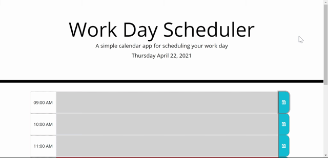

# Work Day Scheduler Starter Code

Live URL: https://augustinandrea.github.io/workday_scheduler/Develop

GitHub Repository: https://github.com/augustinandrea/workday_scheduler

In this code I create a scheduler that goes from 9AM to 5PM. At the top it lists the weekday, date, month, and year. At the bottom there are text boxes that can be wrote in. By pressing the save button, the text can be saved to local storage. The color of the boxes change depending on the time of day.

